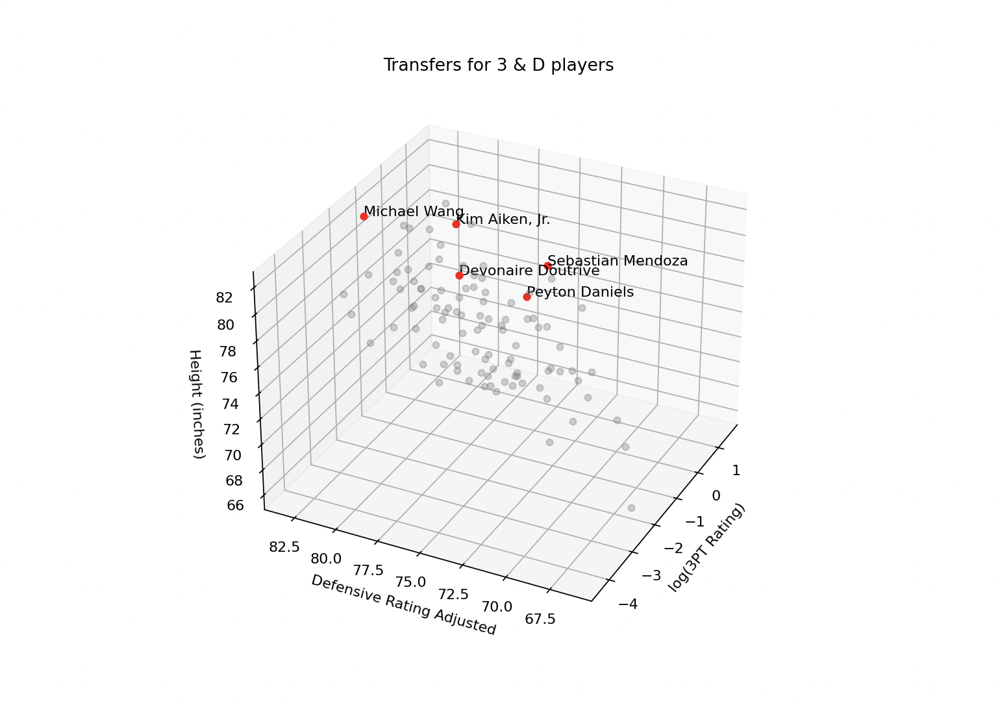
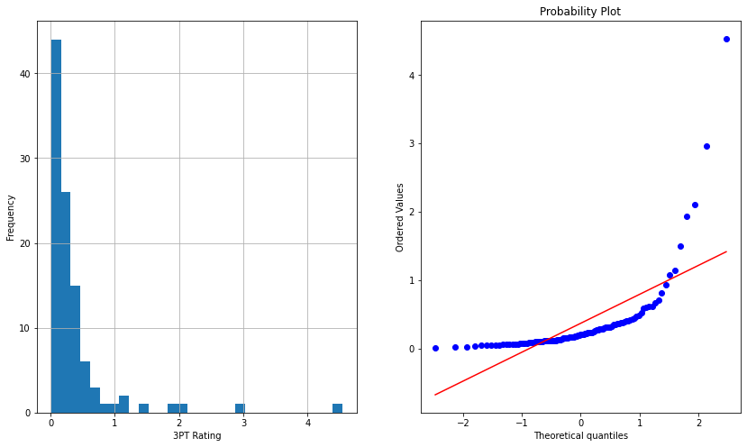

# NCAA Transfer Portal Evaluator
Evaluating NCAA Division 1 Men's Basketball players. The goal was to analyze potential transfer portal players that possess the skills and fits the mold of a 3 and D player. Extra spacing and shooting gravity creates easier offensive possessions while defensive ability along with height tends to allow teams to be more versatile defensively.

# Model

<figcaption align = "center"><b>Top 5 Players in Red.</b></figcaption>
Kim Aiken, Jr. (Arizona), Sebastian Mendoza (San Jose State), Peyton Daniels (Vanderbilt), Devonaire Doutrive (Boise State), Michael Wang (Penn).

The model looks at 3 key factors: defensive adjusted rating (DAR), 3 point rating, and height.

$3PT Rating = (3 Point Percentage * (3Pointer Attempted/Minutes Played)) * (1 + (.0075 * Minutes Per Game))$ from [Bill Goldblatt](http://www.82games.com/Adjusting.htm).

$Defensive Adjusted Rating = .5 * Defensive Rating + .5 * Defensive Win Shares + Strength of Schedule$.

# Data Collection
2022 NCAA Division 1 transfer players from [Verbal Commits](https://www.verbalcommits.com/transfers/2022) and accessed corrresponding statistics for each player via [Sports Reference](https://www.sports-reference.com/cbb/). Here is my former teammate and 2022 transfer [Anthony Yu](https://www.sports-reference.com/cbb/players/anthony-yu-1.html)!

# Data Processing

The model looks at only available 2022 transfers, those who had not already committed to another school. This is as of August 11th, 2022.

Based on Goldblatt's decision to eliminate NBA Players who average less than 11 minutes per game, I eliminated college players who played less than 9 miuntes per game, proportional to Goldblatt. Players with 0 3 Pointers made or attempted were also eliminated.

## Feature Engineering
The 3PT Rating was heavily right skewed, so to counter act this, a logarithmic transformation was applied to mimic a normal distribution.

  
   

The top 5 players based on: $total zscore = zscore(log(3PT Rating)) + zscore(Defensive Adjusted Rating) + zscore(height)$ were plotted in red. These players are indicated as having the highest 3 and D potential.

# Libraries
Webscraped with BeautifulSoup4 and organized with pandas, NumPy. Processed with SciPy and plotted with Matplotlib.
